I was building some anticipation of the journey ahead in the flight from Delhi to Leh, with very little sleep and sudden pangs of being stranded in the remote desert of Laddakh.

<!--more-->

### Arrival

I had a very little sleep as there was a 2.5hr layover duration of around 3-5AM at Delhi airport. Every once in a while I was getting sudden pangs of being stranded, deserted or lost in the remote desert of Laddakh. This was my first such trip where I was going to roam for a week with little touch of civilization.

I saw some foreigner but I was mildly interested in talking to those peeps, although I eventually gave in to a guy who was sitting around me. That guy was going to travel along with 4-5 cousins and sisters and they had everything booked from travel agency and those guys had prepared their itinerary. We talked a little bit about whereabouts and what these folks are doing in their life, then I told them that I didn't had any such itinerary and no bookings of any sorts. He did some warning on to be careful and all.

After a while sun came up and we were lost in the beauty of it. I saw the phenomenon of morning sun grazing over the glaciers for the first time in my life and it was beautiful.

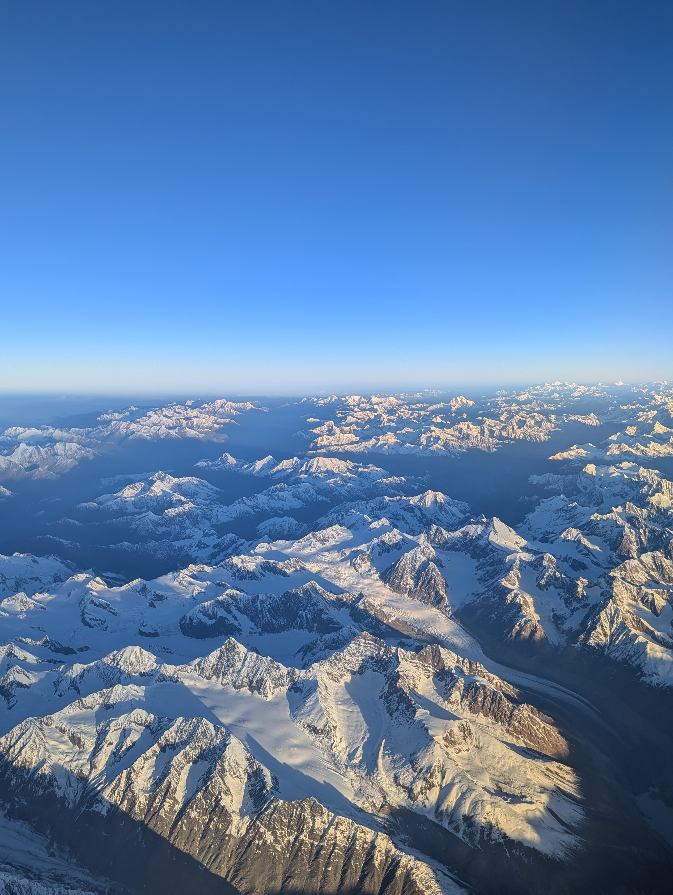

I heard a lot about the breath shortness upon landing at the Leh airport which was again the first time for me but I didn't noticed any significant difference for the first few minutes when we were escorted from airplane to airport via bus. I had a common cold from Bangalore from a week ago and medicines were not helping, I was expecting it to be worse in Laddakh and recovery even slower.

When I got out from airport, holding the only dufflebag and a backpack that I brought, I started feeling a sudden tiredness and weakness. I sorta knew that this is the strange effect that everyone was talking me about. I checked network on my SIM, and it was all emergency-calls only, something was not working and I expected otherwise — that meant I had to go all-cash and no internet until I get myself a local SIM.

Fortunately there was an ATM just outside of the airport exit gate and I got myself some cash enough to pay for the hotel and the cab that I was yet to find. I read somewhere that airport was close-by to the Leh town (3-4 km) even though cab drivers charge something like 500 for dropping you to the town. I didn't had to fight a lot before giving up on walking to the town and to get myself the soonest cab that I can get so I can lay down.

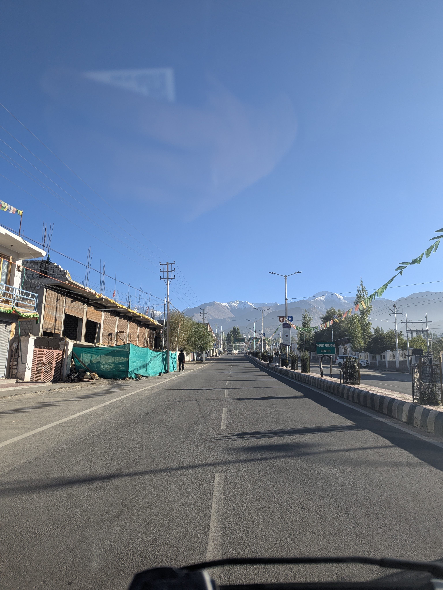

On the way to the mall road, I saw folks prepping for marathon, apparently highest altitude marathon on the world and I was genuinely impressed upon the grit of these people — lot of them were senior folks. I UPI'd the taxi driver using his hotspot and started looking a good place to sleep. I checked for a few hotels before settling in wooden house where there was a lovely Laddaki old lady as the caretaker.

The room had a cozy feeling about it and a big window overlooking backyard and snow capped mountains faraway.

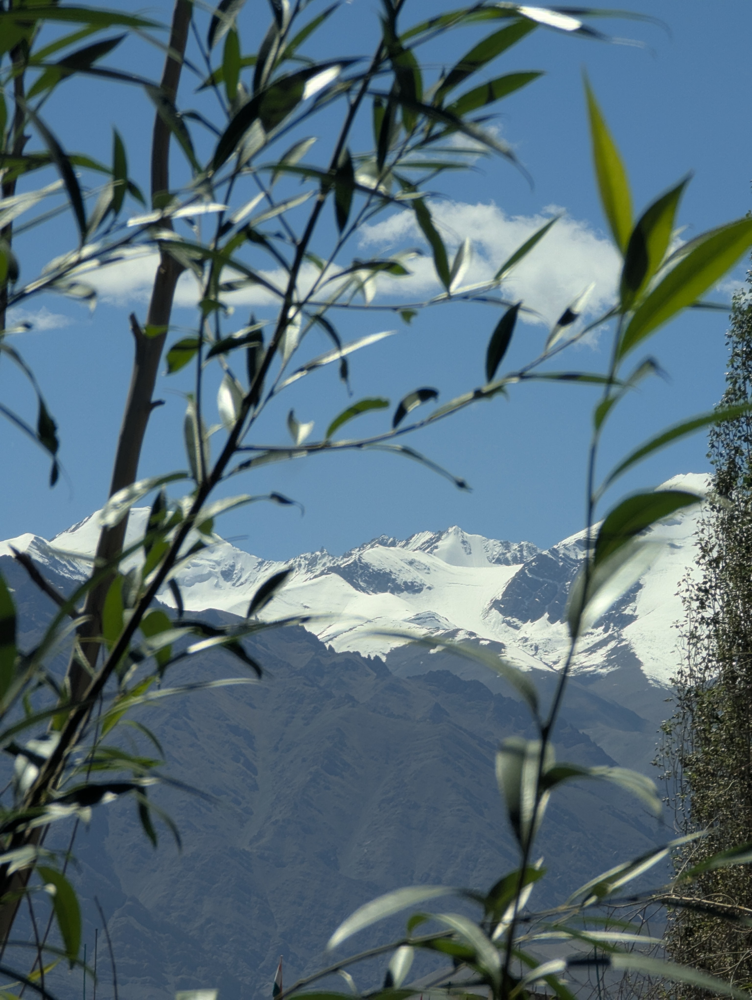

After few minutes of rest, I paid the woman rent for a night and went back for a nap after munching on few cookies that I brought from Bangalore.

I felt a little better when I woke up, and now I had two action items in mind: get a SIM and make UPI work somehow. I got out of the bed and immediately realized if I make sudden movements I would pass out in coma and I still have to limit the movements for proper acclimatization. I went to mall road by taking small steps and got myself a SIM, went back to hotel for another round of nap.

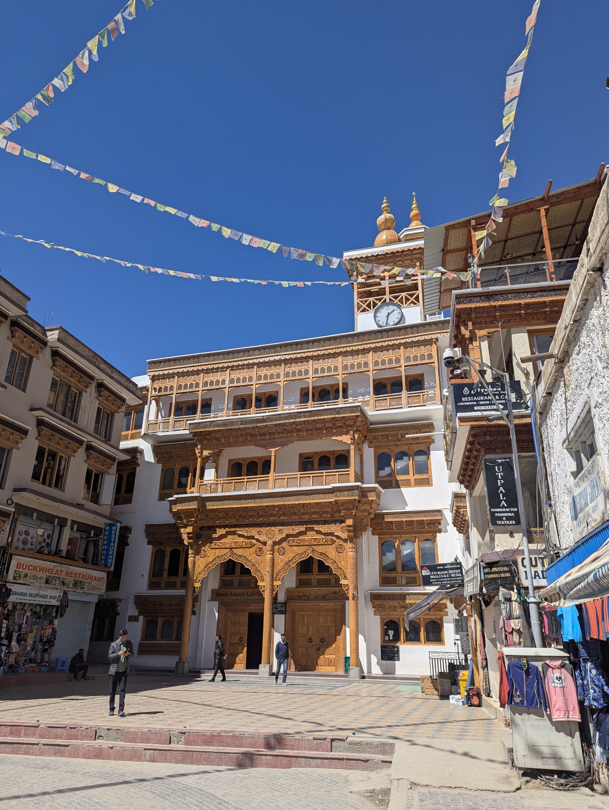

In evening I called home to tell that everything is fine and I got myself a nice place to stay. There was not much in the night, I dined at the place just outside of the hotel, and went back to sleep.

### Settling in

I woke up the next day and felt slightly better. I still had the cold and night was chilly due to the thin air of the place. I made a cup of black coffee that I brought with me from Bangalore — although it is said to be diuretic I feel like it helps the cough. I also warmed some water along with it so I can sip and hope that cold goes away when I go for higher passes.

I went for breakfast in the same shop as yesterday and tried something else. The taste in that shop was not great but I couldn't collect enough courage for a long walk. After breakfast I did a short walk and went back to room for another round of lying around and chatting with some of my friends on WhatsApp on whereabouts.

I went out later in evening for food and checking few things. While on mall road I noticed the closeness of the mountain — those were huge and overlooking the city. It didn't just felt huge though, there was some sort of other-worldly experience attached to them. I got to know few corners of the city after roaming around a bit.

When I went back to room, I was planning for the next day on what stuff to cover. With a little chat with ChatGPT, it was suggested to go either Srinagar way (up to Alchi monastery) or go to Manali way up to Thiksey monastery, which felt a little sub-optimal to me given that I had the full day tomorrow. I checked opening time of the highest rated reliable rental shop in Leh, grabbed dinner at some random place, and went for sleep.

### Getting the bike

On day 2, it was cold but I was feeling excited to get things going. I went for the shop that I searched the earlier day where the shop opening time was mentioned as 8:30 AM. The streets leading the way were narrow and looked something less visited. When I reached at the shop it was closed. I asked an old man who was sitting on a porch but he was someone who was just passing by and has a local business to attend to.

I went for a little stroll ahead of the pathway. The houses were built in a Tibetan architecture and were of pretty much the same colour, perhaps following the traditional colour convention. I noticed that in almost all of the houses, there were small gardens filled of apple trees with little flocks of apples on them.

I took a bunch of photos as this was the first time I was seeing an apple tree with apples — up until now this was mostly a distant fruit who just happen to appear in the market.

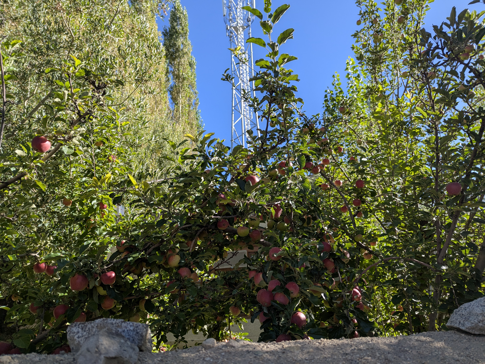

I followed the same street a bit more. There was a fast voluminous river stream with bluish water, felt like coming from all the way from the skies.

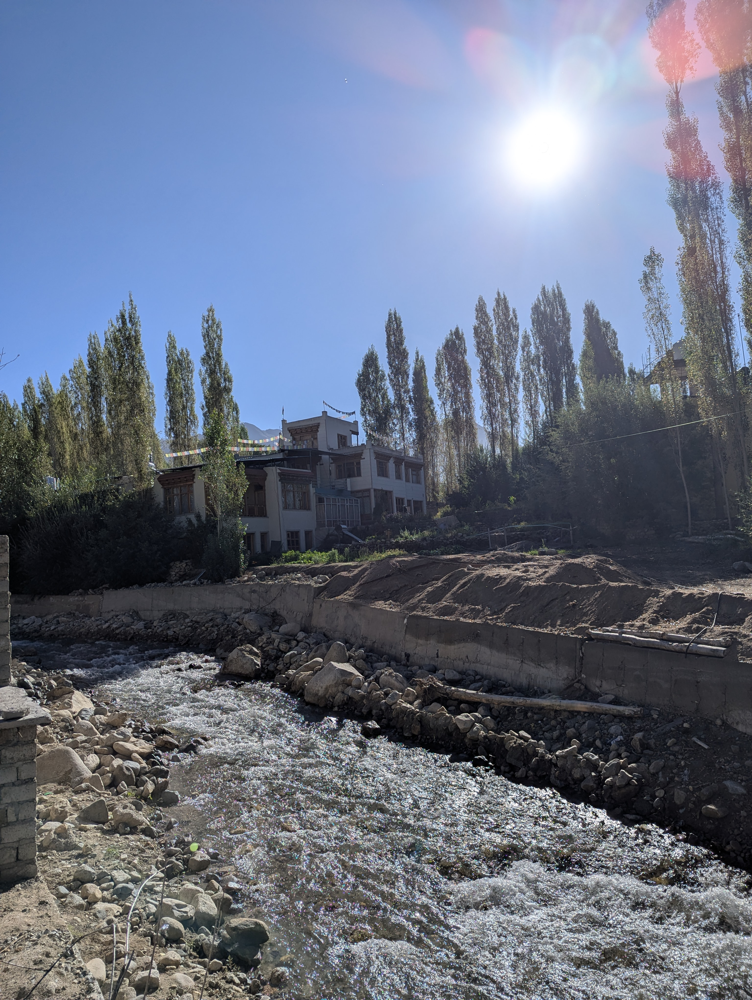

I went back to look for other rental shops in the same street. I noticed handplastering on the walls of the houses, it was a beautiful sight to see.

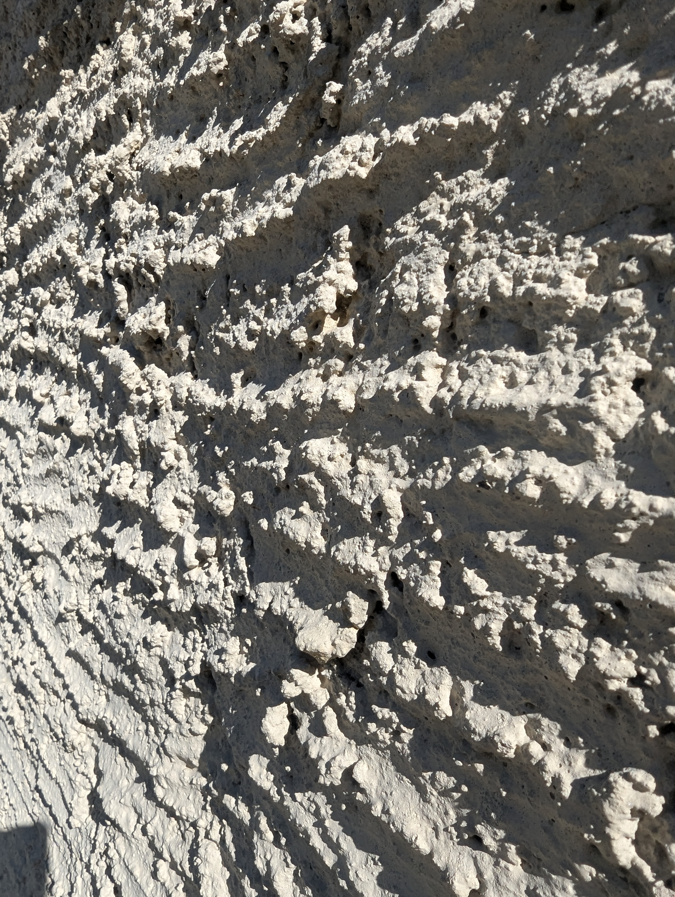

I found few shops that were renting out Himalayan 411s. I checked one and immediately rented it out and came back to my homestay for few packings and gearing up.

### The Leh-Manali highway

I started from my homestay after having a breakfast at the same shop as earlier, and headed out to the Leh-Manali highway. After riding for 4-5 km the views became insanely beautiful and the roads were quite smooth for most of the part.

The first monastery in which I arrived was Thiksey monastery, which was quite different from the monasteries that I've been in the past.

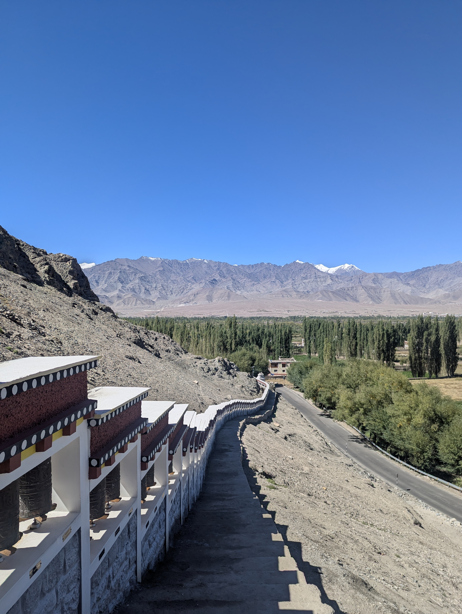

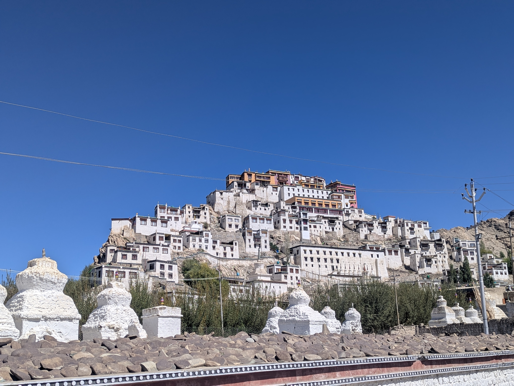

After that I went to some other monasteries on the way, perhaps Shey and Hemis. There were some cliffs that were hanging for which I'd to be careful about, also this was the first time for me where I was riding a Himalayan 411, which was cool but I felt slightly underpowered on corners — yet this bike had that grit.

While I was on the way to Shey, I saw a white woman cycling her way on the top and I thought this might be a niche thing and also quite impressive. Cycling up this altitude is not an easy feat.

I didn't went inside the Shey monastery, it was mostly for the ride that I visited this place. The monastery was built on top of a hill, looked more like a fort as it overlooked the Indus river below.

I visited Hemis, which was slightly farther away from Shey and I liked riding through the open lands, which was quite the first time for me. Hemis appeared to be built on slope of a mountain and gave a vibe of larger than life, the colour of the walls were deep red.

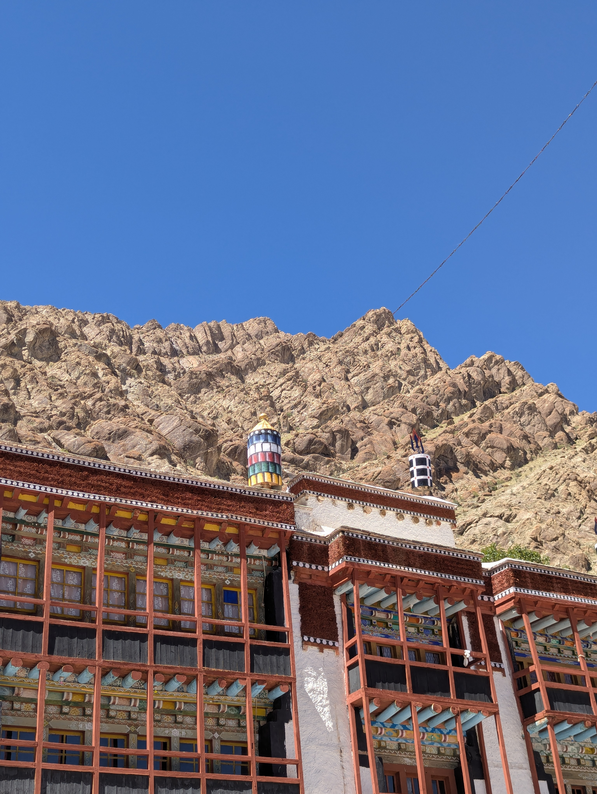

It was a bit of climb reaching the monastery from parking space to the actual gate. I felt coughing, which I had been assuming to be a sign of altitude sickness. There was a little crowd, mostly prudent and not breaking too many rules and peacefulness of surroundings.

I spent sometime sitting in the corridor and observing other tourist clicking photos of themselves with the monastery. I noticed they don't pay much attention to the intricate detailing or the colour usage on the walls. Perhaps a fraction second observation from their POV is enough to justify the attention of the detailing and they need not go into the details as they've other things to cover.

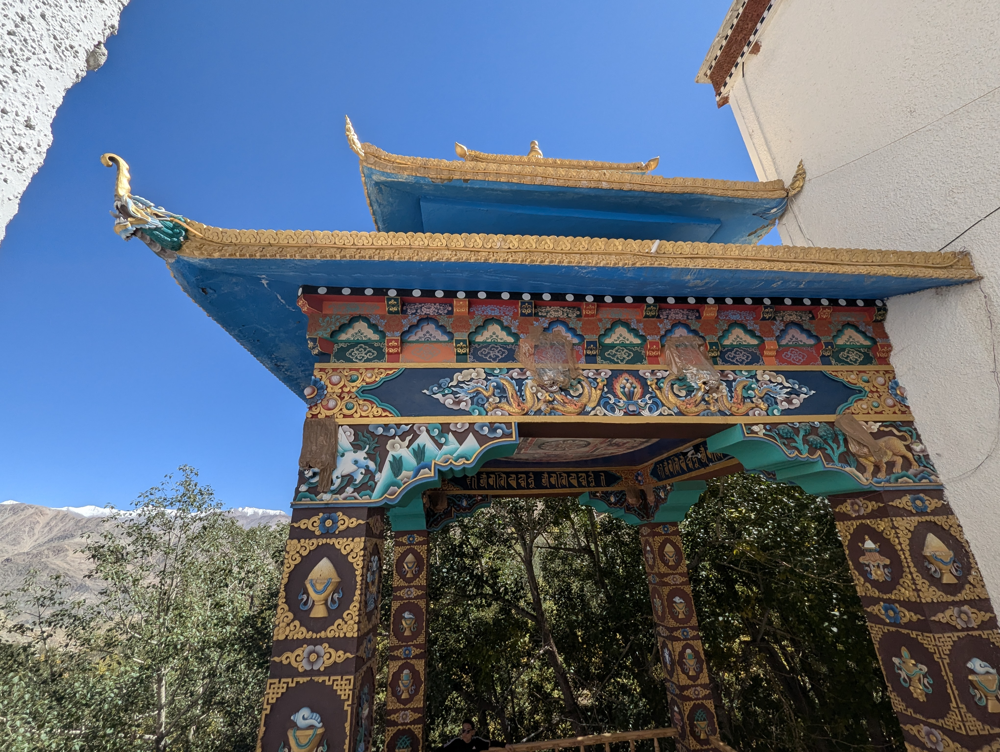

Path of the monastery goes through a village and my Google Maps was not working exactly as I hoped for. There was a rapid flowing just below the entrance of the monastery and cohesion of that with bare mountains and red colour made the atmosphere quite a good one for tranquillity.

I was getting quite hungry so I ordered a black coffee and a sandwich from a cafe below. I was sitting in a middle but after sometime a stranger requested me if I could move on one side so they could accommodate more people — perhaps there were 4-5 with them. I didn't thought much and moved. While paying the bill, another woman said hello to me and I responded back and started back to Leh to visit the monastery on the other side of the road towards Alchi, which I heard from one of my colleague was where monks usually gave apples.

### Sangam and the road to Alchi

First point of where I was supposed to reach on that way was the sangam of two rivers at Nimu. But on the way I found the villages filled with pine and apricot trees quite beautiful.

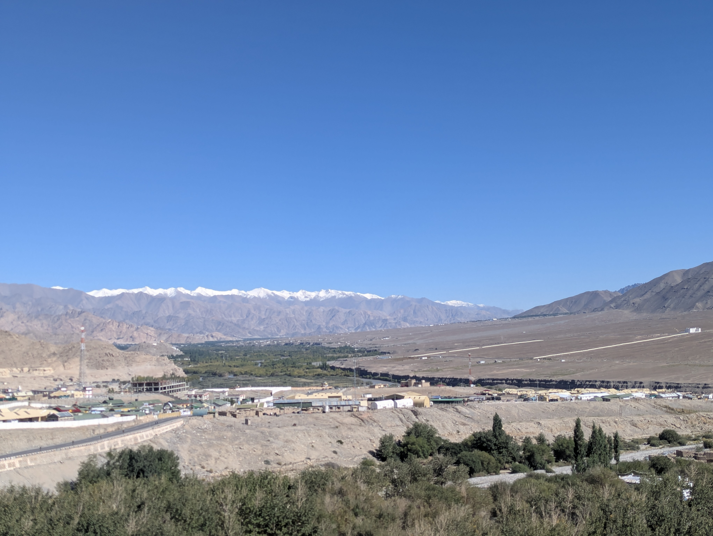

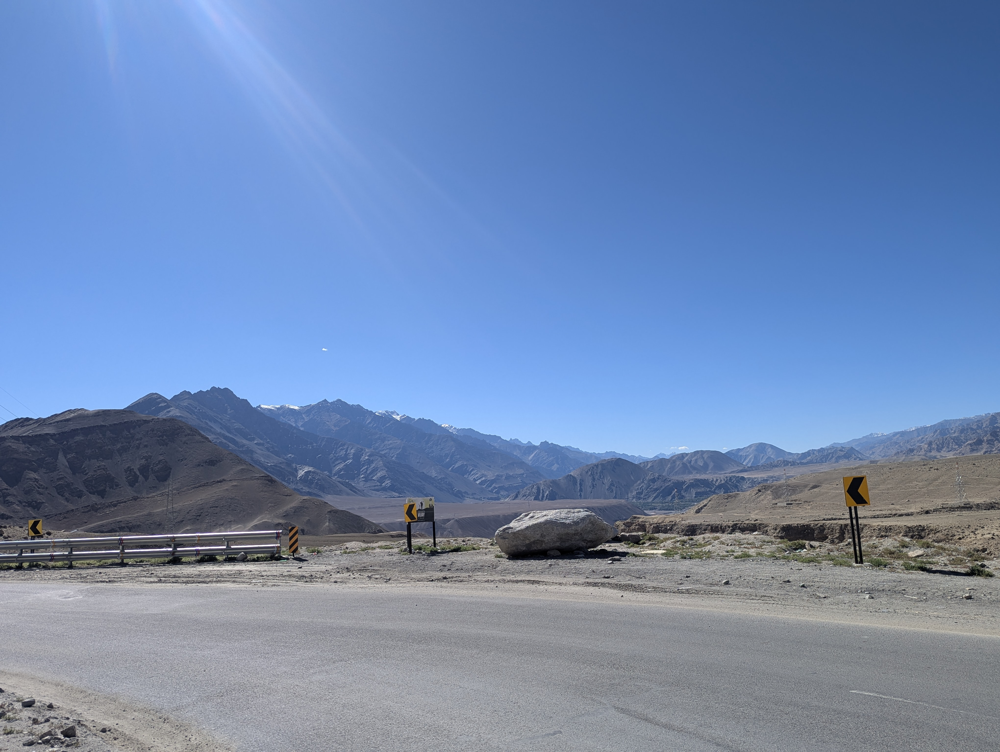

Eventually I reached the sangam of Zanskar and Indus river. I could barely make out the rivers by their colours — I know Zanskar is supposed to be muddy while Indus was magical blue. But the colours of the mountains, that deep brown beige, was giving quite a contrast to the sky and the rivers.

Honestly, that might be the first sangam of the rivers that I saw in my life.

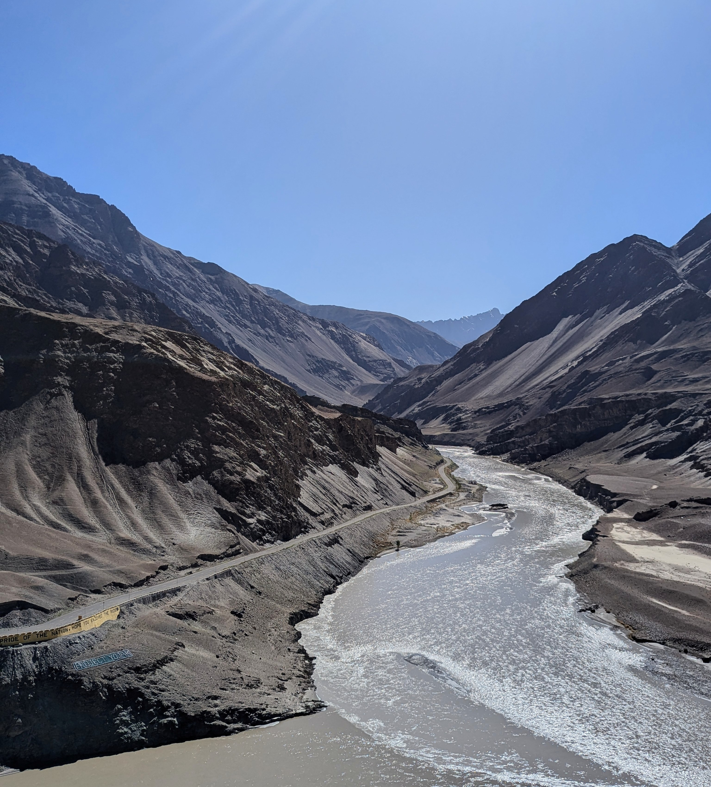

I went ahead on the way to Alchi monastery, saw some villages and eventually stopped at a point for my second lunch. These rides at high altitude was making me hungry quite a lot. I stopped at one point, ordered chicken fried rice and special masala tea and went ahead to the monastery.

On the way, I stopped for few photos as I found the pine tree kinda cool.

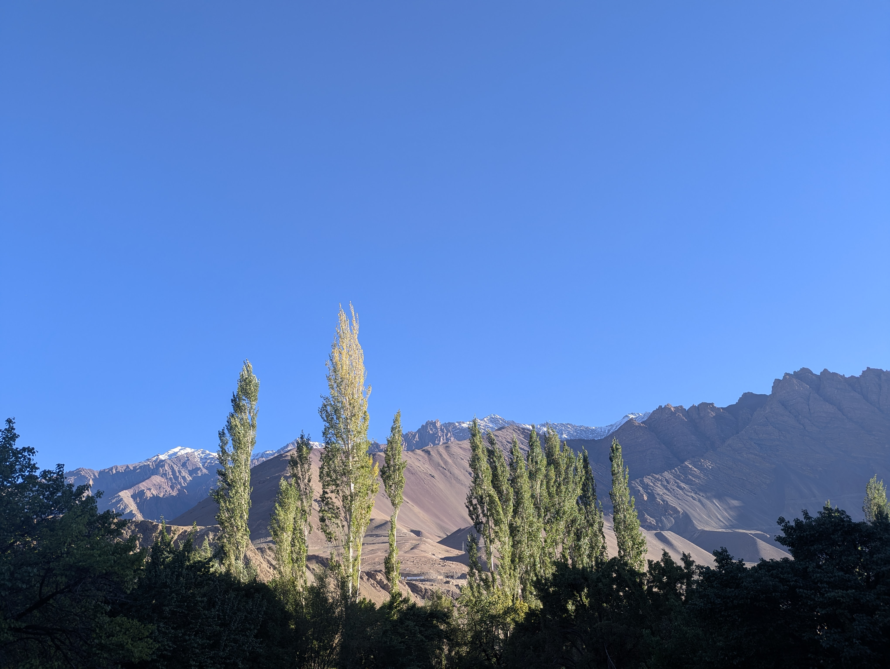

It was almost evening when I finally found the way to the monastery as I had been misled by Google Maps leading to a closed path to public over a dam. I kinda guessed the village that must have been around the monastery. I expected a little bit of tourists but there weren't any.

The woman standing near the gate asked me if I wanted to visit the monastery and if yes, then I must hurry before the monks close the gate for general visit. I went inside. The path to the monastery was narrow and up for a walk, there were few stalls on the ground hosted by locals selling different souvenirs and also a few apple vendors. I had to submit my mobile phone and helmet and all the gadget before entering.

Alchi monastery gave a feeling of being something antique but not quite cared of in preservation — I guess it might have been due to leadership changes of the monastery over the years. There were five temples inside of it, each featuring a giant prayer wheel with various photos of lamas and Buddhist demons. I visited most of them and thought to leave before it gets too dark.

### The Milky Way

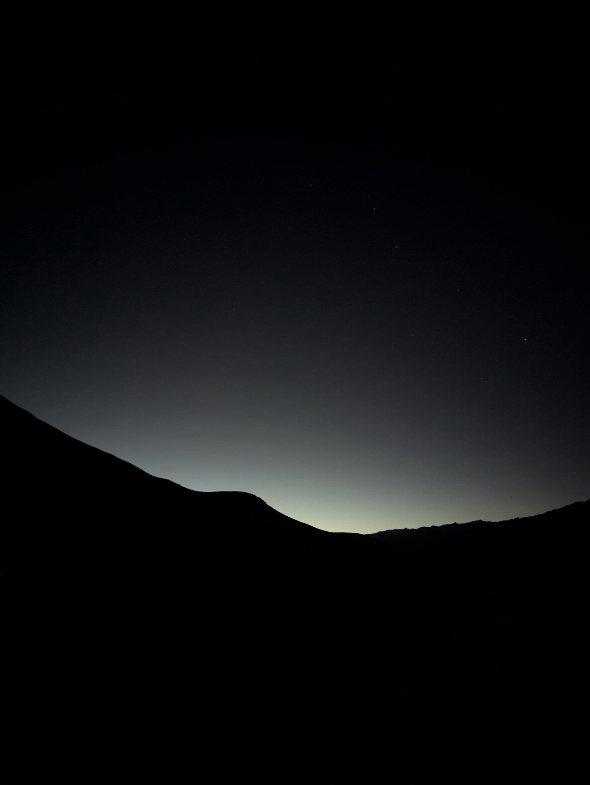

On the way back I found a weird phenomena where it was entirely dark in the surrounding but the sky was lit up. I thought only if I could wait a little more I should be able to see the Milky Way galaxy.

I waited at random points. Tossed in few toffees that I collected from a local shop for reasons that I can't remember and sat on the roadside. Saw few bike riders pass by, also lot of trucks and pickups — I guess those were coming from somewhere in Kashmir or Kargil, I don't know.

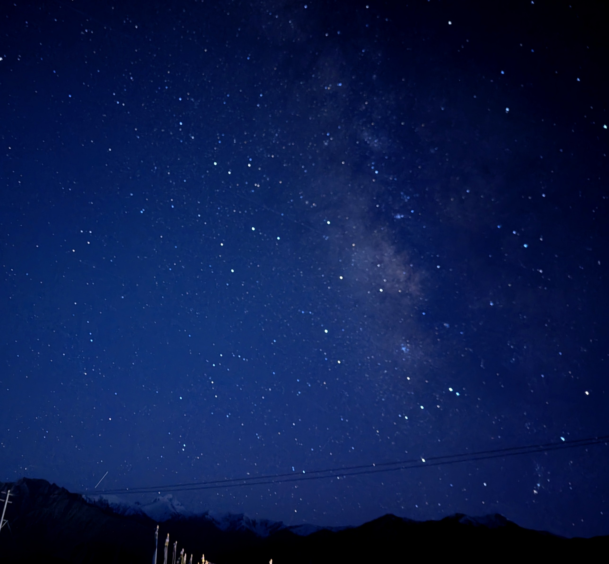

Finally, it went fully dark and the ghostly silhouettes were no longer visible. And yes, I was able to see the galaxy with my naked eye. This was the first time for me seeing the galaxy even though I read about it in books 10 years ago.

I started feeling slightly cold and thought better to reach at the bike rental company before it gets too late. I eventually arrived in Leh, got some cash and returned the bike, went back to hotel for a dinner and sleep. It was a good day.
